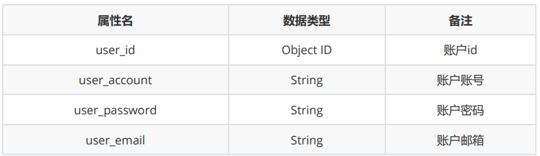

# 设计文档

3180105871，孙嘉锴

## 目录

* 文档介绍
* 项目介绍
* 总体设计
* 结构设计

## 文档介绍

### 目的

本设计文档的目的是

1. 定义软件总体要求，作为用户和开发人员之间相互了解的基础
2. 提供性能要求、初步设计等信息，作为开发人员进行结构设计与开发的基础 
3. 作为软件总体测试的依据

### 预期读者

* 验收者
* 开发者

## 项目介绍

* 项目名称：物联网应用网站
* 任务提出者：课程教师
* 开发者：[本人](https://github.com/SJoJoK)
* 项目概述：物联网应用网站是浙江大学2020-2021学年秋冬学期B/S体系软件设计的课程作业，主要内容是搭建一个MQTT协议服务器以接收指定物联网终端发送的数据，除基础的用户注册、登录功能外，为用户提供创建或修改设备信息、统计与查询设备数据、记录与区分设备位置等功能。
* 面向用户：验收团队，以及需要查看、统计与编辑物联网终端信息的人群

## 总体设计

### 运行环境

#### 服务器硬件要求

* CPU：不小于2.0GHz
* 内存：不小于2.0GB
* 硬盘：不小于40GB
* 网络带宽：不小于10Mbps

#### 服务器软件要求

* 操作系统：Linux
* 数据库：MongoDB
* 前端框架：React
* 后端框架：Express
* MQTT代理：Aedes

### 功能模块

#### 用户管理

| 功能名称 | 功能描述                                                     |
| :------: | :----------------------------------------------------------- |
|   注册   | 1.注册需要提供邮箱验证 2.用户名、密码均有格式、长度要求 3.邮箱与用户名一一对应，且不可重复 |
|   登录   | 1.针对不同的异常情况，进行对应的反馈 2.登陆成功即可进入用户主页 |
|   注销   | 1. 可以退出当前账户                                          |

#### 设备管理

| 功能名称 | 功能描述                               |
| :------: | -------------------------------------- |
|   创建   | 注册一个新的物联网终端设备             |
|   删除   | 删除一个已有的物联网终端设备           |
|   修改   | 修改设备信息                           |
|   连接   | 需要可以根据用户信息唯一标识终端并连接 |
| 数据获取 | 需要可以根据用户信息收集终端发布的数据 |
| 查询统计 | 根据名称、状态等进行设备的查询与统计   |
| 信息显示 | 显示设备信息，如通信时间、通信地点等   |

#### 地图信息

|  功能名称  | 功能描述                                                 |
| :--------: | -------------------------------------------------------- |
|  信息统计  | 首页提供设备信息统计，如设备总量、在线总量、接收数据量等 |
| 数据可视化 | 使用美观、高效的数据可视化方法显示信息                   |

## 结构设计

### 层次设计

#### 表示层

用于显示数据与接受用户的输入，为用户提供交互式操作界面

#### 业务逻辑层

处于数据访问层与表示层中间，对数据访问层而言，它是调用者；对表示层而言，它是被调用者，负责 系统领域业务的处理，负责逻辑性数据的生成、处理与转换，对所输入的逻辑性数据的正确性及有效性负责。

#### 数据访问层

负责对数据库数据的访问、删除、修改等操作，可以访问数据库系统、二进制文件、文本文档等

### 流程图

## 数据库设计

### E-R图

### 表

#### 账户信息表

#### 设备信息表

#### MQTT包

## 软件容错报错设计

### 出错信息

### 补救措施

1. 如果遇到常规错误，则可以参照上述方式解决
2. 当程序出现较大问题时，需要立刻启动备份程序
3. 如果无法启动备份程序，暂停程序的服务并进行维护

## 总结

本设计报告，首先说明了报告编写的目的，然后阐述了项目的总体设计，包括运行环境要求与功能模块 组成，再阐述了项目的结构设计，包括服务器的层次设计与用户访问流程图，之后阐述了项目的服务器 设计，给出了E-R图与相应表定义，最后在系统容错报错设计一章中，主要说明了软件维护、测试和验 证设计。本设计报告，将为此后系统实施、测试、验收提供依据及技术路线支持
